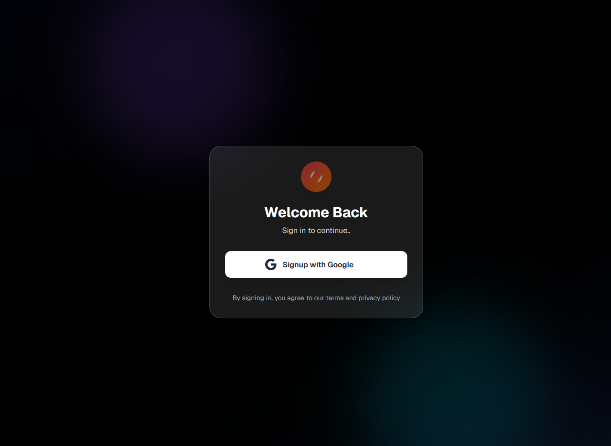
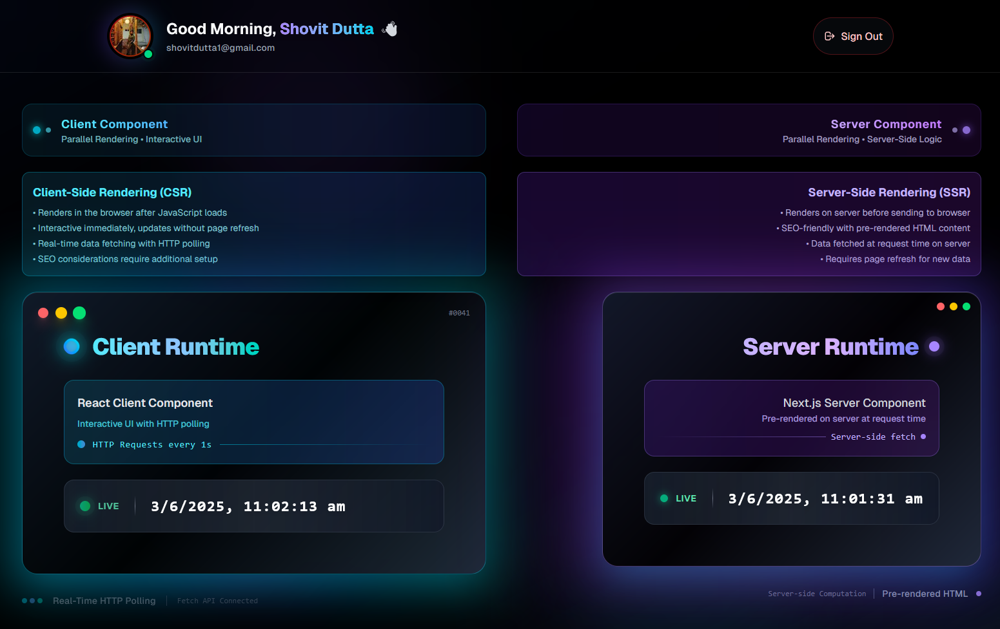
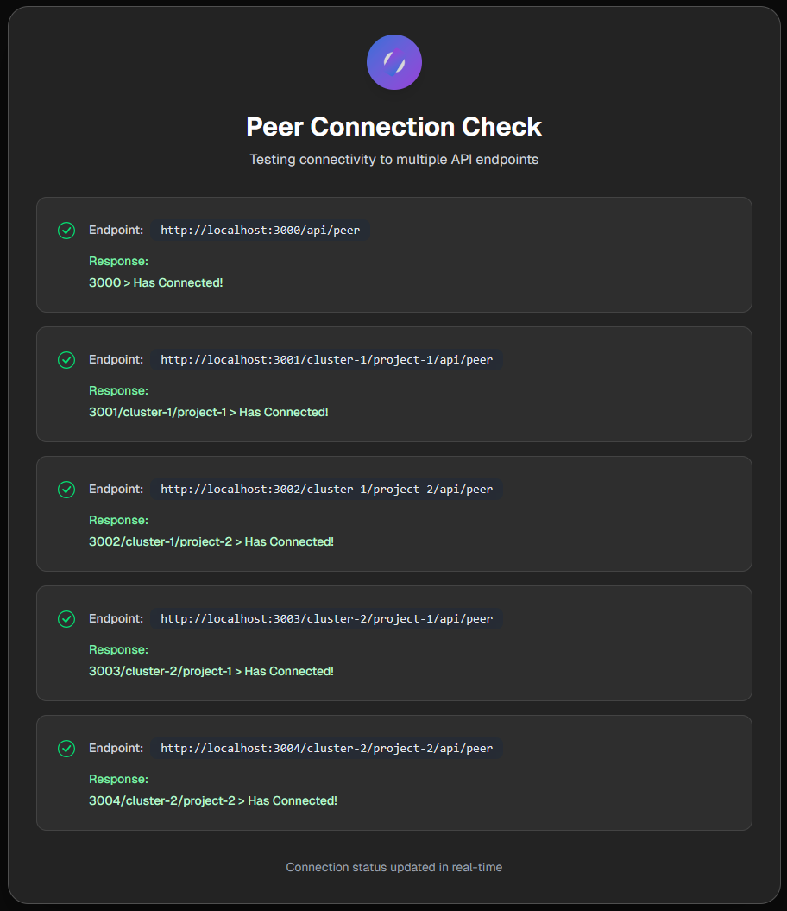

# Cosmos.ts ✨

<p align="left">
  
</p>

<p align="left">
  
  
  
  
  
  
</p>

<p align="left">
  
  
  
  
  
  
</p>

<p align="left">
  
  
  
  
  
  
  
  
</p>

🚀 **A Lightning-Fast TypeScript Multi-Repo Framework For Next.js** - Built for scale, designed for speed, powered by the revolutionary cluster architecture!

<p align="left">
  
  
  
</p>

## 🌟 What Makes Cosmos.ts Special?

> **⚡ Performance First** - Leveraging Bun's lightning-fast package management and TurboRepo's intelligent caching  
> **🏗️ Cluster Architecture** - Revolutionary project organization that scales from startup to enterprise  
> **🛡️ Type Safety** - 100% TypeScript with comprehensive type coverage  
> **🔐 Enterprise Auth** - Production-ready authentication with NextAuth.js v5  
> **📊 Smart State Management** - Optimized with Zustand + TanStack Query combo

## Table of Contents 📚

- [🚀 Project Overview](#project-overview-🚀)
- [💡 Features](#features-💡)
- [🛠️ Technologies Used](#technologies-used-🛠️)
- [🏗️ Project Structure](#project-structure-🏗️)
- [🏁 Getting Started](#getting-started-🏁)
    - [✅ Prerequisites](#prerequisites-✅)
    - [📦 Installation](#installation-📦)
    - [🔑 Environment Variables](#environment-variables-🔑)
    - [▶️ Running the Application](#running-the-application-▶️)
- [🗄️ Database Setup](#database-setup-🗄️)
- [🔒 Authentication Flow](#authentication-flow-🔒)
- [📊 Data Management](#data-management-📊)
- [⚙️ Configuration](#configuration-⚙️)
- [📜 Scripts](#scripts-📜)
- [🐳 Docker](#docker-🐳)
- [🖥️ Runtime Configuration](#runtime-configuration-🖥️)
- [⚠️ Customization Guide](#customization-and-important-considerations-⚠️)
- [🤝 Contributing](#contributing-🤝)
- [📄 License](#license-📄)

---

## Project Overview 🚀

**Cosmos.ts** is the next-generation TypeScript monorepo framework that revolutionizes how you build and manage multiple Next.js applications. Born from the need for true scalability, it introduces
the groundbreaking **"cluster"** architecture that organizes your projects into logical, manageable groups.

🎯 **Perfect for:**

- 🏢 Enterprise applications with multiple teams
- 🔥 Micro-frontends architecture
- 🌐 Multi-tenant SaaS platforms
- 📱 Product suites with shared components
- 🚀 Rapid prototyping and MVP development

**Key Differentiators:**

- ⚡ **Bun-powered** - 3x faster installs and builds
- 🧠 **Intelligent clustering** - Logical project organization
- 🔄 **Hot reloading** across all projects
- 📦 **Shared everything** - Components, configs, and utilities
- 🛡️ **Production-grade** - Battle-tested architecture

---

## Features 💡

### 🏗️ **Revolutionary Architecture**

- **🌌 Cluster-Based Organization** - Group related projects for better maintainability
- **⚡ TurboRepo Integration** - Lightning-fast builds with intelligent caching
- **🔗 Shared Dependencies** - Optimized package management across all projects

### 🛡️ **Enterprise-Grade Security**

- **🔐 NextAuth.js v5** - Modern authentication with multiple providers
- **🛡️ Type-Safe Auth** - Full TypeScript integration with Drizzle adapter
- **🔒 Route Protection** - Middleware-based security for all applications

### 📊 **Intelligent Data Management**

- **🗃️ Drizzle ORM** - Type-safe database operations with auto-migrations
- **💾 SQLite Ready** - Zero-config database for development
- **🔄 Smart Caching** - TanStack Query for efficient server state
- **⚡ Zustand State** - Lightweight global state management

### 🎨 **Developer Experience**

- **🎯 100% TypeScript** - Complete type safety across the monorepo
- **🎨 Tailwind CSS** - Consistent design system with shared configurations
- **✨ Framer Motion** - Smooth animations out of the box
- **🧹 ESLint + Prettier** - Automated code quality and formatting

### 🚀 **Production Ready**

- **🐳 Docker Support** - Complete containerization with Nginx routing
- **📊 Monitoring Ready** - Built-in health checks and logging
- **🔧 Environment Management** - Sophisticated config management
- **📈 Scalable Architecture** - From prototype to enterprise

---

## Technologies Used 🛠️

### Core Framework 🌐

- **[Next.js 14](https://nextjs.org/)**  - React framework with App Router
- **[TypeScript](https://www.typescriptlang.org/)**  - Type-safe JavaScript
- **[React 18](https://reactjs.org/)**  - Modern React with Concurrent Features

### Build & Package Management ⚡

- **[Bun](https://bun.sh/)**  - Ultra-fast package manager & runtime
- **[TurboRepo](https://turborepo.org/)**  - High-performance monorepo system

### Database & ORM 🗄️

- **[Drizzle ORM](https://orm.drizzle.team/)**  - Type-safe SQL toolkit
- **[SQLite](https://sqlite.org/)**  - Lightweight database
- **[Better SQLite3](https://github.com/WiseLibs/better-sqlite3)**  - High-performance SQLite driver

### Authentication & Security 🔐

- **[NextAuth.js v5](https://next-auth.js.org/)**  - Complete auth solution
- **[Zod](https://zod.dev/)**  - Schema validation

### State Management 📊

- **[Zustand](https://zustand-demo.pmnd.rs/)**  - Lightweight state management
- **[TanStack Query](https://tanstack.com/query/latest)**  - Powerful data synchronization

### UI & Styling 🎨

- **[Tailwind CSS](https://tailwindcss.com/)**  - Utility-first CSS framework
- **[Framer Motion](https://www.framer.com/motion/)**  - Production-ready animations
- **[PostCSS](https://postcss.org/)**  - CSS transformation toolkit

### Development Tools 🧰

- **[ESLint](https://eslint.org/)**  - Code linting
- **[Prettier](https://prettier.io/)**  - Code formatting
- **[Docker](https://www.docker.com/)**  - Containerization

---

## Project Structure 🏗️

Cosmos.ts uses a sophisticated monorepo architecture designed for maximum scalability and maintainability:

```
📁 Cosmos.ts/
├── 📦 config/                    # 🔧 Shared configurations workspace
│   ├── 📂 eslint/               # 🧹 ESLint rules & configs
│   ├── 📂 next/                 # 🌐 Next.js shared settings
│   ├── 📂 tailwind-config/      # 🎨 Tailwind base configuration
│   ├── 📂 tailwindcss/          # 🎨 Extended Tailwind styles
│   └── 📂 typescript/           # 📝 TypeScript configurations
├── 📁 source/                   # 🚀 All application code
│   ├── 🏠 __main__/            # 🎯 Primary Next.js application
│   │   ├── 🔐 auth.ts          # NextAuth.js configuration
│   │   ├── 🗄️ drizzle/         # Database schema & migrations
│   │   ├── 🛡️ middleware.ts    # Route protection
│   │   ├── 📂 src/app/         # Next.js App Router structure
│   │   └── ⚙️ scripts/         # Application-specific scripts
│   └── 🌌 clusters/            # 🔥 Revolutionary cluster architecture
│       ├── 📁 cluster-1/       # First logical project group
│       │   ├── 📂 project-1/   # Independent Next.js app
│       │   └── 📂 project-2/   # Another independent app
│       └── 📁 cluster-2/       # Second logical project group
│           ├── 📂 project-1/   # Scoped project naming
│           └── 📂 project-2/   # Maximum flexibility
├── 🤖 scripts/                 # 🛠️ Monorepo automation scripts
│   ├── 🧹 clean.js            # Deep cleanup utility
│   ├── 💬 commit.js           # AI-powered commit messages
│   ├── ⚙️ setup.js            # Environment orchestration
│   └── 🔄 update.js           # Bulk dependency updates
├── 🐳 dockerfile              # Container definition
├── ⚡ turbo.json              # TurboRepo configuration
└── 📦 package.json            # Root workspace definition
```

### 🌟 **Cluster Architecture Explained**

The **cluster** concept is Cosmos.ts's secret weapon:

- 🎯 **Logical Grouping** - Organize projects by domain, team, or feature
- 🔗 **Shared Resources** - Common components and utilities across clusters
- 🚀 **Independent Deployment** - Each project can be deployed separately
- 👥 **Team Boundaries** - Perfect for multi-team development
- 📈 **Scalable Growth** - Add clusters as your organization grows

---

## Getting Started 🏁

### Prerequisites ✅

**⚡ Required Tools:**

- **[Bun](https://bun.sh/) v1.0+**  - **MANDATORY** package manager
- **[Node.js](https://nodejs.org/) v18+**  - Runtime environment
- **[Docker](https://www.docker.com/)**  - For containerization (optional)

> 🚨 **Important:** Cosmos.ts is optimized for **Bun only**. Using npm or yarn will result in suboptimal performance and potential compatibility issues.

### Installation 📦

**1. Clone & Setup** 🔥

```bash
git clone https://github.com/ShovitDutta/Cosmos.ts.git
cd Cosmos.ts
```

**2. Install with Bun** ⚡

```bash
bun install
```

**3. Initialize Environment** 🚀

```bash
bun run setup
```

> 💡 **Pro Tip:** The setup script auto-generates Docker configs and nginx routing based on your `cosmos.yaml` file!

### Environment Variables 🔑

Create your environment configuration:

**📁 `source/__main__/.env`**

```env
# 🗄️ Database Configuration
DATABASE_URL="file:./sqlite.db"

# 🔐 Authentication Secrets
NEXTAUTH_SECRET="your-super-secure-secret-here"
NEXTAUTH_URL="http://localhost:3000"

# 🌐 Google OAuth (Optional)
AUTH_GOOGLE_ID="your-google-client-id"
AUTH_GOOGLE_SECRET="your-google-client-secret"

# 🔗 Inter-Service Communication
NEXT_PUBLIC_CONNECT_PEERS="http://localhost:3000,http://localhost:4001"
```

> 🔒 **Security Note:** Generate a secure `NEXTAUTH_SECRET` using `openssl rand -base64 32`

### Running the Application ▶️

**🚀 Start Development Server**

```bash
bun dev
```

**🌐 Access Your Apps:**

- **Main App:** http://localhost:3000
- **Cluster Projects:** http://localhost:4001, http://localhost:4002, etc.

**📊 Monitor All Services:**

```bash
bun run dev:all  # Starts all clusters simultaneously
```

---

## Database Setup 🗄️

Cosmos.ts uses **Drizzle ORM** for type-safe database operations:

### 🛠️ **Database Operations**

**Initialize & Migrate:**

```bash
bun run drizzle-things
```

This command:

- 📊 Pushes schema changes to database
- 📝 Generates migration files
- ⬆️ Applies pending migrations

**🔍 Database Studio (Visual Interface):**

```bash
bun run db:studio
```

### 📋 **Schema Management**

Edit your schema in `source/__main__/drizzle/schema.ts`:

```typescript
import { sqliteTable, text, integer } from "drizzle-orm/sqlite-core";

export const users = sqliteTable("users", {
    id: integer("id").primaryKey(),
    name: text("name").notNull(),
    email: text("email").unique().notNull(),
});
```

---

## Authentication Flow 🔒

**NextAuth.js v5** provides enterprise-grade authentication:

### 🔐 **Supported Providers**

- **🌐 Google OAuth** - Social login
- **🐙 GitHub** - Developer-friendly
- **🎮 Discord** - Community platforms
- **📧 Credentials** - Custom authentication

### 🛡️ **Security Features**

- **🔒 JWT Sessions** - Stateless authentication
- **🗄️ Database Sessions** - Persistent storage with Drizzle
- **🛡️ Route Protection** - Middleware-based security
- **🔄 Auto-refresh** - Seamless token renewal

### ⚙️ **Configuration**

Authentication is configured in `source/__main__/auth.ts`:

```typescript
import NextAuth from "next-auth";
import Google from "next-auth/providers/google";
import { DrizzleAdapter } from "@auth/drizzle-adapter";

export const { auth, handlers } = NextAuth({
    adapter: DrizzleAdapter(db),
    providers: [
        Google({
            clientId: process.env.AUTH_GOOGLE_ID,
            clientSecret: process.env.AUTH_GOOGLE_SECRET,
        }),
    ],
});
```

---

## Data Management 📊

**Cosmos.ts** uses a powerful combination for optimal data handling:

### 🐻 **Zustand - Global State**

```typescript
import { create } from "zustand";

const useStore = create((set) => ({
    user: null,
    setUser: (user) => set({ user }),
}));
```

### ⚡ **TanStack Query - Server State**

```typescript
import { useQuery } from "@tanstack/react-query";

function Profile() {
    const { data, isLoading } = useQuery({
        queryKey: ["profile"],
        queryFn: fetchProfile,
    });
}
```

### 🗄️ **Drizzle ORM - Database**

```typescript
import { eq } from "drizzle-orm";
import { users } from "./schema";

const user = await db.select().from(users).where(eq(users.id, 1));
```

---

## Configuration ⚙️

### 🧹 **ESLint** - Code Quality

Shared ESLint configurations ensure consistent code quality:

- **`base.js`** - Core TypeScript rules
- **`next.js`** - Next.js specific linting
- **`react-internal.js`** - Internal React components

### 🌐 **Next.js** - Framework Settings

Centralized Next.js configuration:

```typescript
import { commonNextConfig } from "@cosmos/next";

export default commonNextConfig({
    // Your custom overrides
});
```

### 🎨 **Tailwind CSS** - Design System

Unified styling across all projects:

```javascript
import { tailwindConfig } from "@cosmos/tailwind-config";

export default tailwindConfig;
```

### 📝 **TypeScript** - Type Safety

Consistent TypeScript settings:

```json
{
    "extends": "@cosmos/typescript/nextjs.json"
}
```

---

## Scripts 📜

### 🌍 **Global Scripts** (Root Level)

| Command           | Description           | Purpose                        |
| ----------------- | --------------------- | ------------------------------ |
| `bun dev`         | 🚀 Start development  | Launch all development servers |
| `bun build`       | 🏗️ Build all projects | Production-ready builds        |
| `bun start`       | ▶️ Start production   | Launch production servers      |
| `bun lint`        | 🧹 Lint all code      | Code quality checks            |
| `bun format`      | ✨ Format code        | Prettier formatting            |
| `bun commit`      | 💬 AI commit          | AI-generated commit messages   |
| `bun clean`       | 🧽 Deep clean         | Remove all artifacts           |
| `bun update`      | 🔄 Update deps        | Bulk dependency updates        |
| `bun setup`       | ⚙️ Initialize         | Environment setup              |
| `bun check-types` | 🔍 Type check         | TypeScript validation          |

### 🐳 **Docker Scripts**

| Command              | Description       | Purpose                 |
| -------------------- | ----------------- | ----------------------- |
| `bun docker:start`   | 🐳 Full restart   | Stop → Build → Run      |
| `bun docker:build`   | 🏗️ Build image    | Create Docker image     |
| `bun docker:publish` | 🚀 Run container  | Start containerized app |
| `bun docker:stop`    | 🛑 Stop container | Clean shutdown          |
| `bun docker:prune`   | 🧹 Clean Docker   | Remove unused resources |

---

## Docker 🐳

**Complete containerization with intelligent routing:**

### 🏗️ **Build & Run**

```bash
# 🚀 One-command deployment
bun docker:start

# 🌐 Access via reverse proxy
open http://localhost:8000
```

### 🔧 **Generated Configuration**

The `bun setup` command automatically generates:

- **📋 `supervisord.conf`** - Process management
- **🌐 `nginx.conf`** - Reverse proxy routing
- **🔧 Environment files** - Service configuration

### 🌟 **Features**

- **⚡ Hot reloading** in development
- **🔄 Auto-restart** on crashes
- **📊 Health monitoring** built-in
- **🌐 Intelligent routing** between services

---

## Runtime Configuration 🖥️

**Cosmos.ts** uses a powerful `cosmos.yaml` configuration system:

### 📋 **Example Configuration**

```yaml
HOST_PORT: 8000 # 🌐 Main access port

BASE: # 🏠 Main application
    - NAME: main
      PORT: 3000
      COMMAND: /bin/sh -ec "bun run build && bun start"
      ENVIRONMENT_VARIABLES:
          DATABASE_URL: "__main__.db"
          NEXT_PUBLIC_BASE_PORT: 3000
          AUTH_TRUST_HOST: "true"
          # ... more config

CLUSTERS: # 🌌 Project clusters
    - NAME: cluster-1
      PROJECTS:
          - NAME: project-1
            PORT: 4001
            COMMAND: /bin/sh -ec "bun run build && bun start"
            ENVIRONMENT_VARIABLES:
                NEXT_PUBLIC_BASE_PATH: "/cluster-1/project-1"
                # ... project-specific config
```

### 🎯 **Key Benefits**

- **🔧 Centralized configuration** for all services
- **🌐 Automatic routing** generation
- **🔗 Inter-service communication** setup
- **📊 Environment management** per project

---

## Customization and Important Considerations ⚠️

### 🎯 **Core Principles**

**✅ DO:**

- 🔄 Extend existing configurations
- 🌟 Add new clusters and projects
- 🎨 Customize UI components and styles
- 🔐 Implement additional auth providers
- 📊 Add new database schemas

**❌ DON'T:**

- 🚫 Modify core TurboRepo configuration without understanding
- 🚫 Break shared configuration patterns
- 🚫 Remove type safety measures
- 🚫 Ignore security best practices

### 🛡️ **Security Checklist**

- [ ] 🔒 Strong `NEXTAUTH_SECRET` (32+ characters)
- [ ] 🌐 Proper CORS configuration
- [ ] 🔐 Secure OAuth callback URLs
- [ ] 📋 Environment variable validation
- [ ] 🛡️ Route protection middleware

### 🚀 **Performance Optimization**

- [ ] ⚡ Use Bun for all package operations
- [ ] 🗄️ Optimize database queries with Drizzle
- [ ] 📦 Leverage TurboRepo caching
- [ ] 🎨 Minimize Tailwind CSS bundle size
- [ ] 🔄 Implement proper React Query caching

### 📈 **Scaling Guidelines**

- **👥 Team Size:** 1-5 developers per cluster
- **📊 Project Count:** Up to 20 projects per cluster
- **🗄️ Database:** Consider PostgreSQL for production
- **🌐 Deployment:** Use container orchestration for multiple clusters

---

## Contributing 🤝

We love contributions! Here's how to get involved:

### 🚀 **Quick Start**

1. **🍴 Fork** the repository
2. **📥 Clone** your fork locally
3. **🌿 Create** a feature branch
4. **💻 Make** your awesome changes
5. **✅ Test** thoroughly
6. **📤 Submit** a pull request

### 📋 **Contribution Guidelines**

**🎯 Code Quality:**

- ✅ Follow TypeScript best practices
- 🧹 Use ESLint and Prettier (run `bun format`)
- 📝 Add JSDoc comments for public APIs
- 🧪 Include tests for new features

**💬 Commit Standards:**

- 📜 Use [Conventional Commits](https://www.conventionalcommits.org/)
- 🤖 Or use `bun commit` for AI-generated messages
- 🔍 Keep commits focused and atomic

**📚 Documentation:**

- 📖 Update README for new features
- 💡 Add inline code comments
- 🎯 Include usage examples

### 🏆 **Recognition**

Contributors are recognized in our:

- 📊 GitHub contributors section
- 🎉 Release notes
- 🌟 Hall of Fame (coming soon!)

---

## License 📄

**Currently UNLICENSED** - Please contact [@ShovitDutta](https://github.com/ShovitDutta) for licensing inquiries.

---

<div align="center">

### 🌟 **Made with ❤️ by the Cosmos.ts Team** 🌟

**[⭐ Star us on GitHub](https://github.com/ShovitDutta/Cosmos.ts)** • **[🐛 Report Issues](https://github.com/ShovitDutta/Cosmos.ts/issues)** •
**[💬 Join Discussions](https://github.com/ShovitDutta/Cosmos.ts/discussions)**


</div>

---

<details>
<summary>📊 <b>Project Stats & Metrics</b></summary>


